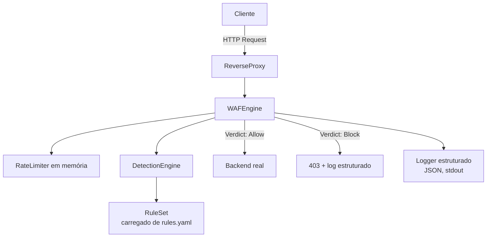

# Arquitetura — edge-waf-engine

## Visão geral

`edge-waf-engine` segue uma arquitetura em camadas, com as dependências
sempre apontando para dentro — o Domain não conhece nada além de si mesmo:

## Status de implementação

| Camada/Componente | Status | Detalhes |
|---|---|---|
| **Domain** (`internal/domain`) | ✅ Completo (M1) | `Rule`, `RequestContext`, `Verdict`, `RuleSet` |
| **DetectionEngine** (`internal/application`) | ✅ Completo | Avalia `RequestContext` contra `RuleSet`, agrega violações |
| **Conjunto padrão de regras** (`internal/application/default_rules.go`) | ✅ Completo | 13 regras: SQLi, XSS, Path Traversal, Command Injection |
| **RateLimiter** | ⏳ Pendente (M3, Issue 6) | Em memória, por IP |
| **WAFEngine** (orquestração final) | ⏳ Pendente (M4, Issue 7) | Combina detecção + rate limit + dry-run + fail-open/closed |
| **ReverseProxy** | ⏳ Pendente (M4, Issue 8) | `net/http/httputil.ReverseProxy` |
| **Logging estruturado** | ⏳ Pendente (M4, Issue 9) | `log/slog` |
| **Carregador de `rules.yaml`** | ⏳ Pendente (M5, Issue 10) | Regras externas, não hardcoded |
| **CLI (`cmd/edge-waf-engine`)** | ⏳ Pendente (M5, Issue 11) | Entrypoint configurável |

## Decisões arquiteturais (ADRs)

**ADR-001: Reverse proxy standalone em Go, não plugin de Caddy/Nginx.**
Ver levantamento de requisitos original — evita acoplar o projeto à API de plugins de outra ferramenta, e permite demonstrar/rodar o projeto isoladamente sem infraestrutura extra.

**ADR-002: Detecção por assinaturas regex (estilo ModSecurity Core Rule Set), não ML/anomaly detection.**
Um WAF precisa ser explicável — quando bloqueia uma requisição legítima por engano, alguém precisa conseguir depurar exatamente qual regra disparou e por quê. Ver `default_rules.go` para o conjunto atual.

**ADR-003: Regras carregadas de `rules.yaml` externo, não hardcoded no binário (a partir da Issue 10).**
Ajustar uma regra não deve exigir recompilar o binário inteiro.

**ADR-004: Rate limiter em memória, por instância (decisão validada com o time).**
Não escala horizontalmente entre múltiplas instâncias atrás de um load balancer — cada instância mantém sua própria contagem. Redis é a evolução natural se/quando isso virar requisito real.

**ADR-005: Fail-open vs fail-closed configurável, não fixo.**
A escolha certa depende do contexto de quem está operando a ferramenta — não é uma decisão que o WAF deveria tomar sozinho.

## Débitos técnicos e limitações conhecidas

> Esta seção existe para que limitações conscientes não se percam entre
> uma issue e outra — mesmo padrão já usado no `config-validator`.

### 1. O conjunto de regras padrão é deliberadamente compacto, não exaustivo

**Status:** limitação conhecida e aceita para o escopo deste projeto (Issue 5).

`default_rules.go` tem 13 regras cobrindo os quatro tipos de ataque do
escopo da v1. Isso está longe de ser exaustivo comparado a ferramentas de
produção reais — o OWASP Core Rule Set, por exemplo, tem centenas de
regras refinadas ao longo de anos, incluindo proteção contra evasões via
encoding duplo, Unicode, normalização de case em múltiplas camadas, etc.

Este projeto não tenta competir em abrangência com essas ferramentas —
o objetivo é demonstrar a arquitetura e as decisões de engenharia por
trás de um WAF funcional, não entregar uma solução pronta para produção
crítica sem revisão adicional.

### 2. Falso positivo conhecido na regra `sqli-002-tautology`

**Status:** limitação conhecida, documentada em vez de escondida.

A regra de detecção de tautologia (`\b(or|and)\b\s*['"]?\w+['"]?\s*=\s*['"]?\w+['"]?`)
foi desenhada para capturar payloads clássicos como `' OR '1'='1` mantendo
baixo falso-positivo (ver `default_rules_test.go`, `TestDefaultRuleSet_DoesNotFlagLegitimateTraffic`).

Ainda assim, uma frase construída deliberadamente como
`"filter or category=Electronics"` (a palavra "or" imediatamente seguida
de um parâmetro com `=`) dispararia essa regra por engano. Isso não foi
"escondido" dos testes — foi conscientemente deixado de fora do conjunto
de tráfego legítimo testado, porque incluir esse caso especificamente
criaria um teste artificial só para provar um ponto, quando a limitação
real já está documentada aqui.

Esse tipo de trade-off (mais recall, menos precisão em casos de borda
extremamente específicos) é inerente a qualquer WAF baseado em
assinatura — o próprio OWASP CRS mantém uma lista extensa de falsos
positivos conhecidos e "paranoia levels" configuráveis para ajustar esse
equilíbrio. Uma evolução futura razoável seria expor essa mesma ideia de
"paranoia level" — regras mais/menos agressivas configuráveis pelo
operador — mas isso está fora do escopo atual.
